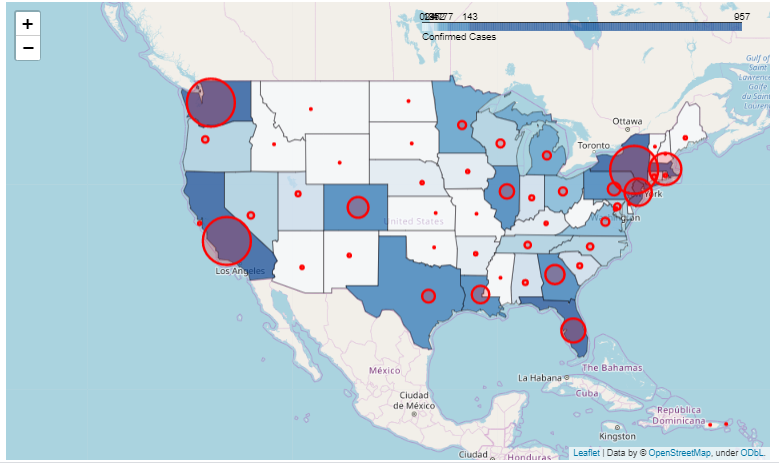

# Project1_Group1
* Project 1, Group 1, for the January to July Cohort of the Data Analytics Boot Camp at Rice
* Norman Gwinn | Panarat Duke | Michael Heitmann | Gini Arimbi

# Project Title: "Covid 19- Who will Suffer the Most?"

## The recent global pandemic on COVID 19 motivated us to find out the preparedness of US health care facility in facing the outbreak.   

## Objectives:
### “Which US states will be the most vulnerable in facing Corona virus cases?”
### To obtain growth rate for cases in global, selected countries, and US 
 * Using linear and exponential plot
### Find correlation between infection cases with country population
 * Using scatter plot and linear regression 
### Comparing the growth rate to availability of health facility (hospital bed per 1000 person) 
 * Using heat map and bubble map

## Results:

### The above graph shows the exponential growth rate for cases globally. 

### The above picture shows the correlation between country population and average of new cases per day. 

### Based on the number of infection cases and availability of hospital bed, we estimate that Washington and California will be the most vulnerable in facing. 

## References
* John Hopkins GitHub Repository : https://github.com/CSSEGISandData/COVID-19.git
* World Bank : https://data.worldbank.org/indicator/SH.MED.BEDS.ZS
* KFF : https://www.kff.org/other/state-indicator/beds-by-ownership/?activeTab=map&currentTimeframe=0&selectedDistributions=total&sortModel=%7B%22colId%22:%22Location%22,%22sort%22:%22asc%22%7D

